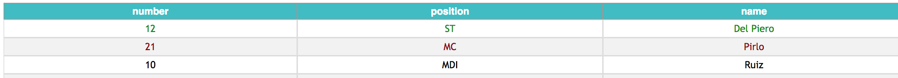
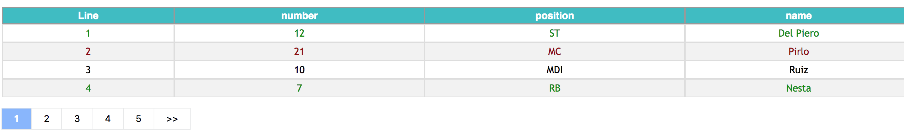

# React-table-with-csv-download
React JS Table and log viewer with CSV download functionality

# Description

React JS Table and log viewer with CSV download functionality. You can display data table information passing JS objects and an array of dats you want to show and download the full data into a csv file. You can pick what fields of the object you want to display and download the full objects.


# How it looks


# Installation

Install it from npm and include it in your React build process (using Webpack, Browserify, etc).

```
npm i react-js-table-with-csv-dl
```

# Usage

Import `TableViewer` in your react component.

```javascript
import TableViewer from 'react-js-table-with-csv-dl';
```

Props available:
* `content` - An array of objects. The key will be used for the table headers.

```javascript
let table = [ 
  {number: 12, name: "Del Piero", position: "ST"},
  {number: 21, name: "Pirlo", position: "MC"},
  {number: 1, name: "Buffon", position: "GK"}
];
```

In the above example, will create a table with three columns: `number, name, position`

Optionally, you can add the key `success` to the object. If value is true, the row will be displayed in green, if it is false will be displayed red.

```javascript
let table = [ {number: 12, name: "Del Piero", position: "ST", success: true},
  {number: 21, name: "Pirlo", position: "MC", success: false},
  {number: 10, name: "Ruiz", position: "MDI"},
];
```

The above object will be displayed as follows:



* `headers` - An array of strings with the headers you want to display

`["number", "name"]`

Use the same names as the object you are passing as prop.
In this case, the table will show only `name` and `number`. In case of downloading data, will download the full object including the `position`. This gives you the ability of showing some fields and being able to download full data rows.

* `minHeight`, `maxHeight` - Min and Max height dimensions for the table

* `activateDownloadButton` - (Boolean) if you want to have a download button


For example:
```javascript
<TableViewer
  title="Lineup"
  content={this.state.table}
  headers={this.state.headers}
  minHeight={0}
  maxHeight={400}
  activateDownloadButton={this.state.activateDownloadButton}
/>
```

If you have big tables, you can optionally add a pagination for the table using the prop `pagination`.



You can also customize the style using the following props:

* `headerCss` => style for headers e.g passing: {{color: "blue", backgroundColor:"#fff"}}
Changes the header background to white and the text to blue

* `bodyCss` => style for each row e.g passing: {{color: "blue", backgroundColor:"#fff"}}
Changes the background to white and the text to blue

# Props

| Name        | Type            | Mandatory | Description  
| ------------- |:-------------:| -----:|:-----|
| content      | object | Y |Contents to display on tables |
| headers      | array (String)   | Y   | Array of strings, these will be used to choose what to show in the table |
| minHeight | integer     | Y| Min table desired height |
| maxHeight | integer   |Y  | Max table desired height |
| activateDownloadButton | boolean   |Y | Activates download button |
| headerCss | object   |N | Headers customization |
| bodyCss | object   |N | Body customizations |
| filename | String   |N | Name of the downloaded filename (default is logResults.csv) |
| renderLineNumber| present | N | render row number at the left of the table |
| reverseLineNumber| present | N | reverse line number to start from last (depends on reverseLineNumber) |
| pagination| int | N | integer that will indicate the max page size for the table |
| pageBoxStyle| object | N | customize style of pagination box objects |
| activePageBoxStyle| object | N | customize style of active box |
| maxPagesToDisplay| int | N | how many elements will the paginator have. Default 6 |


#What's new
v.0.3.16
* Small default styling improvements

v0.3.14
* Added reverse line number

v0.3.13
* Max Height fixed
* Pagination styles updated
* Fixed a bug when creating a CSV file with commas in the data.

# License 

Licensed under the MIT License.
