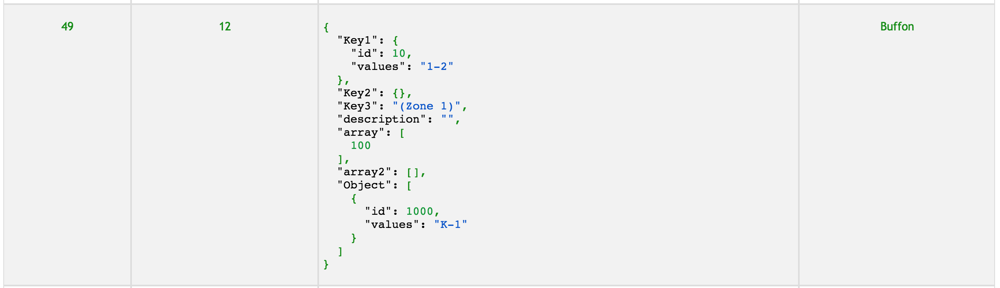

# React-table-with-csv-download
React JS Table and log viewer with CSV download functionality accepts text, json and JSX for rendering.

# Description

React JS Table and log viewer with Search and CSV download functionality. You can display data table information passing JS objects and an array of data you want to show and download the full data into a csv file. You can pick what fields of the object you want to display and download the full objects. Also you can pass a String with a JSON and will be rendered.

**How to thank me?**
Just click on ⭐️ button :)

# How it looks


# Installation

Install it from npm and include it in your React build process (using Webpack, Browserify, etc).

```
npm i react-js-table-with-csv-dl
```

# Usage

Import `TableViewer` in your react component.

```javascript
import TableViewer from 'react-js-table-with-csv-dl';
```

Props available:
* `content` - An array of objects. The key will be used for the table headers.

```javascript
let table = [ 
  {number: 12, name: "Del Piero", position: "ST"},
  {number: 21, name: "Pirlo", position: "MC"},
  {number: 1, name: "Buffon", position: "GK"}
];
```

In the above example, will create a table with three columns: `number, name, position`

Optionally, you can add the key `success` to the object. If value is true, the row will be displayed in green, if it is false will be displayed red.

```javascript
let table = [ 
  {number: 12, name: "Del Piero", position: "ST", success: true},
  {number: 21, name: "Pirlo", position: "MC", success: false},
  {number: 10, name: "Ruiz", position: "MDI"},
];
```

The above object will be displayed as follows:


* `headers` - An array of strings with the headers you want to display

`["number", "name"]`

Use the same names as the object you are passing as prop.
In this case, the table will show only `name` and `number`. In case of downloading data, will download the full object including the `position`. This gives you the ability of showing some fields and being able to download full data rows.

* `minHeight`, `maxHeight` - Min and Max height dimensions for the table

* `activateDownloadButton` - (Boolean) if you want to have a download button


For example:
```javascript
<TableViewer
  title="Lineup"
  content={this.state.table}
  headers={this.state.headers}
  minHeight={0}
  maxHeight={400}
  activateDownloadButton={this.state.activateDownloadButton}
/>
```

You can send a JSON String to a specific cell and will be rendered correctly with different color scheme as shows in the following image:

```javascript
let json = {
  "Key1": {"id":10,"values":"1-2"},
  "Key2":{},
  "Key3":"(Zone 1)",
  "description":"","array":[100],
  "array2":[],
  "Object":[{"id":1000,"values":"K-1"}]
};
```
  
Note that you should convert JSON to a String using the function stringify(). Then, you'll have the result:



You can also customise the row's color (red, green or black) by sending the following row to the table with the key `success`:

true -> green
false -> red
omit the key and the text will be black by default

```javascript
{ 
  number: 1, 
  name:() => <div><a href="#">Buffon</a></div>, 
  position: JSON.stringify(json), 
  success: true
}
```


If you have big tables, you can optionally add a pagination for the table using the prop `pagination`.


You can also customize the style using the following props:

* `headerCss` => style for headers e.g passing: {{color: "blue", backgroundColor:"#fff"}}
Changes the header background to white and the text to blue

* `bodyCss` => style for each row e.g passing: {{color: "blue", backgroundColor:"#fff"}}
Changes the background to white and the text to blue

# Props

| Name        | Type            | Mandatory | Description  
| ------------- |:-------------:| :-----:|:-----|
| activateDownloadButton | boolean   |Y | Activates download button |
| content      | object | Y |Contents to display on tables |
| headers      | array (String)   | Y   | Array of strings, these will be used to choose what to show in the table | 
| maxHeight | integer   |Y  | Max table desired height |
| minHeight | integer     | Y| Min table desired height |
| caseInsensitive | boolean |N| do searches without casing| 
| encoding | String |N| Data encoding for table and file, UTF-8 by default |
| filename | String   |N | Name of the downloaded filename (default is logResults.csv) |
| maxPagesToDisplay| int | N | how many elements will the paginator have. Default 6 |
| pagination| int | N | integer that will indicate the max page size for the table |
| placeholderSearchText| string |N| Placeholder text to appear in Searchbox |
| renderLineNumber| present | N | render row number at the left of the table |
| reverseLineNumber| present | N | reverse line number to start from last (depends on reverseLineNumber) |
|searchEnabled| presence (boolean) |N| Activate search feature|
|sortColumn| string |N| Column that you want to sort Asc. (must be in headers prop)|
| topPagination | boolean |N| show pagination at top of the table| 

# Styling Props

| Name        | Type            | Mandatory | Description  
| ------------- |:-------------:| -----:|:-----|
| activePageBoxStyle| object | N | customize style of active box |
| bodyCss | object   |N | Body customizations |
| downloadButtonStyle| object | N | download button customizations |
| headerCss | object   |N | Headers customization |
| pageBoxStyle| object | N | customize style of pagination box objects |
| tableStyle | object   |N | Overall table style/size |
| titleStyle | object   |N | Overall tile style/size |
| errorColor | string   |N | Hex value for text (default: #b30009)|
| successColor | string   |N | Hex value for text (default: #0b7012)|
| warningColor | string   |N | Hex value for text (default: #ba8722)|

# What's new

v0.9.7
  * Search bar updated

v0.9.6
  * More size optimizations and paginator dependency updated to 0.2.1

v0.9.5
  * Dependencies updated
  * Overall package size optimized

v0.9.4
  * Dependencies updated

v0.9.1
  * Html render -> send html from a func: `htmlTest = () => <div><a href="#">Yep</a></div>`
  * Dependencies updated
  * Overall package size optimized

v0.8.7
  * Added feature for line change, if you send text with the escape char \n, it will be rendered in different lines in the UI, and also escaped in the CSV download. 
  E.g: let text = '"Gianluigi\nBuffon"'; Check the Example in GitHub.

v0.8.6
  * If there is a tie between an error and a warning, the error will have priority and show the error color

v0.8.3
  * Added feature to generate CSV file with all different columns, even if some rows don't have data for that column. This means that everything will be visible.

v0.7.10 
  * Added warning feature. Will color text in yellow row in case the row has the key warning (boolean:true)
  * Added props for errorColor, successColor, warningColor for further customization

v0.7.9
  * Dependencies updated

v0.7.8
  * Bug fixing and check title style check improvements. Please update if using v >=0.7.0

v0.7.5
  * Small bug fixes, checks and improvements

v0.7.3
  * Title will only appear if table has any kind of contents

v0.7.1
  * New style prop for title called `titleStyle`

v0.7.0
  * Several CSS changes made to table viewer
  * CSS refactored, base name changed
  * New CSS prop: `tableStyle` for overall table styling
  * Possible breaking changes: if you rely on the old css `tableViewer` prefix, please change it to: `tableWithCSV`

# License 
Licensed under the MIT License © [jciccio](https://www.npmjs.com/~jciccio)
